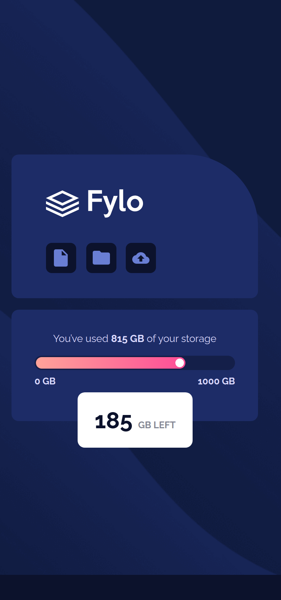

# Frontend Mentor - Fylo data storage component

This is a solution to the [Fylo data storage component challenge on Frontend Mentor](https://www.frontendmentor.io/challenges/fylo-data-storage-component-1dZPRbV5n/hub). Frontend Mentor challenges help you improve your coding skills by building realistic projects. 

## Table of contents

- [Overview](#overview)
  - [Screenshot](#screenshot)
  - [Links](#links)
- [My process](#my-process)
  - [Built with](#built-with)
  - [Continued development](#continued-development)
  - [Useful resources](#useful-resources)
- [Author](#author)
- [Acknowledgments](#acknowledgments)

## Overview

### Screenshot

### Links

- Solution URL: [Github repository](https://github.com/BalazsBanfi/FEM-14-Fylo-data-storage)
- Live Site URL: [Github page](https://balazsbanfi.github.io/FEM-14-Fylo-data-storage)

## My process

### Built with

- Semantic HTML5 markup
- CSS custom properties
- Grid / flexbox
- Mobile-first workflow
- Media-query

### Continued development

I would like to be comfortable with responsive web design techniques, css grid and flexbox and want to perfect mobile-first method.

### Useful resources

- [Homepage of Kevin Powell](https://www.kevinpowell.co/) - Kevin helpes a lot in responsive techniques. I really liked his teaching style and will follow him in the future also.

## Author

- Website - [Bánfi Balázs](https://github.com/BalazsBanfi)
- Frontend Mentor - [@bally4h](https://www.frontendmentor.io/profile/bally4h)
- Linkedin - [@banfibalazs](https://www.linkedin.com/in/banfibalazs/)
)

## Acknowledgments

Thanks for the helps to Frontend Mentor, The Odin Project, freecodecamp.org, Kevin Powell, Web Dev Simplified and many others..